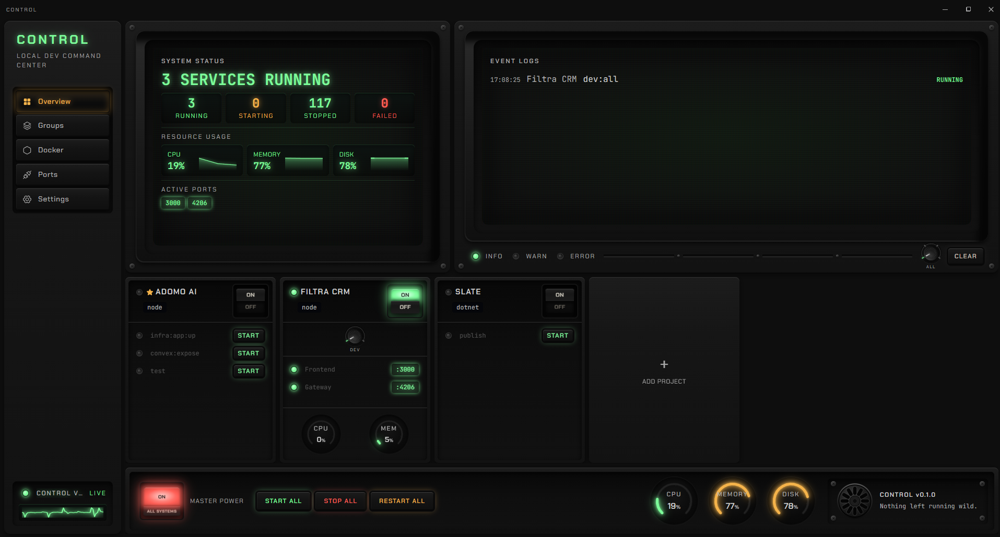
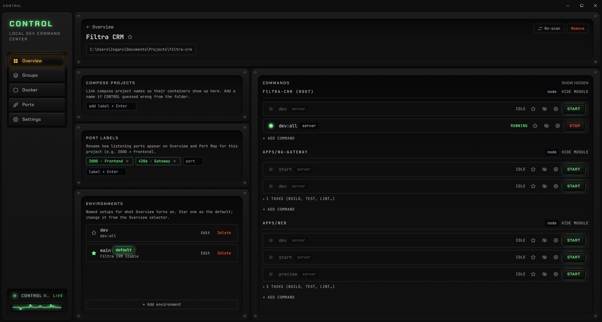

# CONTROL

**Run and track every local service without living in a console.**

Local work no longer lives only in an editor terminal. Agents, chat apps, and
browser tools start services in scattered consoles that are hard to supervise,
and on days you never open a console at all you still need to know what’s
running. CONTROL is the local command center for that map: projects, scripts,
ports, and process state in one place, so you don’t keep it in your head.

A local daemon owns process supervision (host processes and Docker stacks).
The React UI is a thin client over it, so closing the UI never kills your
servers.

See [DESIGN.md](./DESIGN.md) for product goals, design & requirements.
Agent/CI conventions: [AGENTS.md](./AGENTS.md).
Contributing: [CONTRIBUTING.md](./CONTRIBUTING.md).

## Platforms

- **Primary:** Windows 11 — designed and tested for ConPTY, `taskkill`,
  `Get-NetTCPConnection`, and WSL2-aware Docker port attribution.
- **Best effort:** macOS and Linux — the daemon and UI may run via node-pty;
  the host port map and some process tooling are Windows-first and may be
  empty or limited. Not v1 test targets unless CI coverage says otherwise.

CI runs `typecheck` / `test` / `lint` on `ubuntu-latest` and `windows-latest`.

## Prerequisites

- **Node.js ≥22** on `PATH`
- **pnpm** 11.x — the repo pins `packageManager: pnpm@11.5.3`; run `corepack enable`
  once so `pnpm` matches that version
- A C/C++ toolchain for native modules on first `pnpm install`
  (`better-sqlite3`, `node-pty`) — on Windows: Visual Studio Build Tools with
  “Desktop development with C++”; on Unix: build-essential / Xcode CLT
- **Optional:** Docker Engine/Desktop for compose features
- **Optional (native Windows app only):** Rust, WebView2, and MSVC — see
  [`apps/shell/README.md`](./apps/shell/README.md)

## Get running

Contributor setup from a fresh clone:

```bash
git clone git@github.com:Zegaru/control.git
cd control
corepack enable
pnpm install          # compiles native modules (node-pty, better-sqlite3)
pnpm dev              # daemon (:4400) + UI dev server (:5173)
```

Open http://localhost:5173, click **Add Project**, and point it at a repo folder.

Use **`pnpm dev`** for day-to-day work — it starts the daemon and UI with matching
ports. Contributor commands, hot-reload behavior, and split-terminal setup:
[CONTRIBUTING.md](./CONTRIBUTING.md).

## Other ways to run

### Contributor / day-to-day (recommended)

Use **Get running** above: `pnpm dev` → http://localhost:5173. The Vite dev
server proxies `/api` and `/ws` to the daemon.

### Production single-origin

**When to use:** you want one process and one URL (no Vite dev server) — e.g.
smoke-testing a production-like build locally.

```bash
pnpm install
pnpm --filter @control/ui build
pnpm start
```

Open http://127.0.0.1:4400 — the daemon serves the built SPA from `apps/ui/dist`.

### Native Windows app (NSIS installer)

**When to use:** you want a launchable desktop app with tray icon and autostart,
not a browser tab.

```bash
pnpm install
pnpm --filter @control/shell build
```

Produces an installer under
`apps/shell/src-tauri/target/release/bundle/nsis/`
(e.g. `Control_0.1.0_x64-setup.exe`). Prerequisites (Rust, WebView2, MSVC) and
dev workflow: [`apps/shell/README.md`](./apps/shell/README.md).
Node ≥22 must stay on `PATH` at runtime. Unsigned builds may trigger SmartScreen
until signed releases exist.

Tagged releases (`v*`) build that installer on GitHub Actions and attach it to
the [GitHub Release](https://github.com/Zegaru/control/releases). See
[CONTRIBUTING.md](./CONTRIBUTING.md#cutting-a-release).

## If `pnpm install` fails

Native modules (`better-sqlite3`, `node-pty`) compile during install. On
Windows, install **Visual Studio Build Tools** with the **Desktop development
with C++** workload, then retry:

```bash
pnpm rebuild better-sqlite3 node-pty
```

Build scripts for those packages are allowlisted in `pnpm-workspace.yaml`
(`allowBuilds`). If install still fails, see [CONTRIBUTING.md](./CONTRIBUTING.md)
and the README Prerequisites section above.

## Screenshots





## What’s implemented

Milestones **M0–M6** are implemented (M2/M3 as complete working slices):

- ✅ pnpm workspace: `apps/daemon`, `apps/ui`, `packages/shared` (Zod contracts)
- ✅ Daemon: Hono REST + WebSocket, SQLite (better-sqlite3 + drizzle, lightweight column migrations)
- ✅ Supervision (M1): node-pty spawn, ring-buffer logs over WS, graceful-then-tree-kill
- ✅ Detection (M2): modules (nested workspaces) + actions (package.json, compose, Makefile, Cargo, Go, Python)
- ✅ Override-preserving re-scan (favorites/renames survive)
- ✅ Favorites, dashboard, project detail, run log viewer (xterm.js), port map (M3)
- ✅ Startup reconciliation (adopt surviving runs)
- ✅ Docker (M4): dockerode bridge — container state/health/ports, live container
  log streaming (demuxed), containers mapped to projects by compose label,
  Docker events → live refresh
- ✅ Unified port map (M4): every listening port attributed to a managed run, a
  Docker container, or an external host process (`Get-NetTCPConnection`, Windows).
  Precedence is WSL2-aware — Docker-forwarded ports stay attributed to the
  container via the Docker API, never the relay process that owns them at the OS
  level. Port-conflict warnings now cover container/external occupancy too.
- ✅ Orchestration (M5): launch groups (ordered steps with wait-for-healthy/exit),
  group builder UI, action editor (portHint / healthUrl / env + run history),
  per-project multi-compose-project claiming, and a Ctrl/Cmd-K command palette
- ✅ Native app (M6): Tauri desktop shell (`apps/shell`) — spawns/supervises the
  daemon, renders the UI in a native window, tray icon (Open / Restart / Start on
  login / Quit), autostart on login. The NSIS installer embeds a self-contained
  daemon + UI runtime (Node ≥22 still required on PATH).

## Layout

```
apps/daemon/     Node supervision daemon (Hono + WS, node-pty, dockerode, SQLite)
apps/ui/         Vite + React + Tailwind + TanStack Query + xterm.js
apps/shell/      Tauri desktop shell + NSIS installer (staged runtime under runtime/)
packages/shared/ Zod schemas + types shared across the API boundary
```

Daemon state lives in `~/.control/` (SQLite db + per-run log files). For local
overrides see [AGENTS.md](./AGENTS.md) and [`.env.example`](./.env.example).

## Contributing

See [CONTRIBUTING.md](./CONTRIBUTING.md) and the
[Code of Conduct](./CODE_OF_CONDUCT.md). Before opening a PR, run
`pnpm typecheck`, `pnpm test`, and `pnpm lint`.

[`plans/`](./plans/) holds historical implementation handoffs for agents and
maintainers — not a public product roadmap. Product intent lives in
[DESIGN.md](./DESIGN.md).

## License & security

- License: [MIT](./LICENSE)
- Security policy and threat model: [SECURITY.md](./SECURITY.md)
